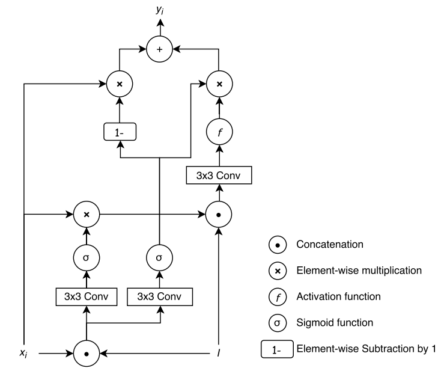
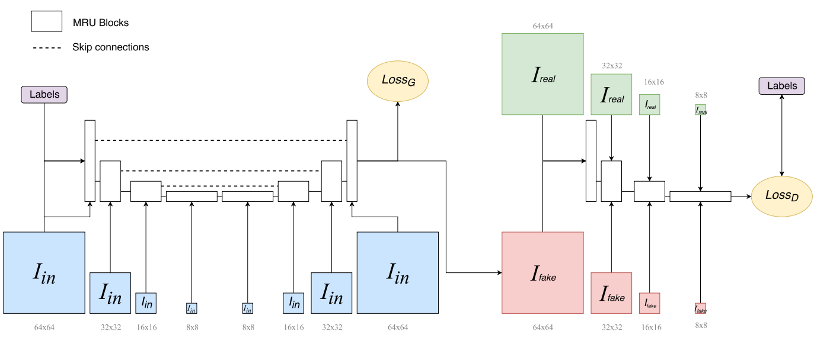

# Overall
## Deep Learning with S-shaped Rectified Linear Activation Units
This paper proposes a new rectified linear activation unit named SRelu. 
Just a piecewise funciton(three parts). Seems boring.

## Densely Connected Convolutional Networks
This paper extends ResNet and makes network more densely connected.
It proposes that each layer has inputs of all the outputs of its previous layers,
all the outputs are concatenated instead of adding together. 

## Xceptions: Deep Learning with DepthWise Separable Convolutions
This papetr is an extention of Inception, it rethinks the Inception module.
We know **regular conv attempts to learn filters in 3D space, 2D spatial dimensions and a channel dimension**, thus
a single convolution kernel is **tasked with simulataneously mapping cross-channel correlations and spatial correlations.**
Here the author thinks that corss-channel correlations and spatial correlations can be decoupled!

So the depthwise separable convolution is first using 1x1x(high dimension number) conv to get high dimension and then do regular
conv operations each channel(each channel a separable conv kernel, 3x3x1, for example.) Finally, concat the outputs of each conv kernel. Overall, **it does regular conv operations in each channel**

## Create Anime Characters with A.I.!
Results are astonishing, yet method is nothing special. It just adopts a type of existing variant of GAN, and using a clean dataset.
The approach of gathering the dataset deserves learning.

## Real-time single image and video super-resolution using an efficient sub-pixel convolutional neural network. (sub-pixel CNN)
It is quite interesting. As usual, a SR task inputs the LR image and outputs the HR image. Mention: the LR image has the same size as HR one. This paper proposes a
sub-pixel conv which upscale the HR\_little to HR. HR\_little has the size of 1/r(r>1)
size of HR. We just add the sub-pixel conv to the last of the model.

This means the layer takes the input of H\*W\*(r\*r\*C) and outputs (r\*H)\*(r\*W)\*C.
It periodically takes the pixel across the channel to construct the small path of r*r.

## Photo-Realistic Single Image Super-Resolution Using a Generative Adversarial Network.
Seems the first paper in SR using GAN.

## Instance Normalization:The Missing Ingredient for Fast Stylization
We all know that BN is that we take the whole batch to calcute the mean and variance of the whole batch. However, Instance Norm calculate means and variances(the same number) of the batch.

## Generative Semantic Manipulation with Contrasting GAN
It makes 'cat'->'dog' transformation come true. As we konw, cycleGAN has no capability of handling such transformations which is largely different in shapes. They proposed the contrasting distance `Q`. The main idea is, let me take `cat` to `dog` as an example.
`x` is a real image of a cat, `y` is a real image of `dog`, `y_g` is generated by G taking x as input under the condition of `c_y`. `c_y` is a one-hot label that the index indicating the dog will be 1 and will be
inserted into the feature latent in the representation of `G(x)`. So we hope the distance between `x` and `y_g` should be **further**  than the distance between `y_g` and `y`. Note that we should not directly take the raw image of `x` as we need `semantic` distance. So
let `D_cy` be the role! That means the distance between `f_x` and `f_y_g` should be further than that between `f_y_g` and `f_y_`. The prefix of `f` means the features in the `D_cy`. `f_y_` means the avearge of features of many `y`(randomly taken) to avoid model oscillation.

## Shape Inpainting using 3D Generative Adversarial Network and Recurrent Convolutional Networks
Firstly, it uses a 3D-Encoder-Decoder(mini) to generate a small 3D object(low resolution). Then it aligns the object along the
first principle conponent dimension and slices it into sequences. Feed them to 3D CNN and then use LSTM to dig out the coherent
information and finally each slice will be processed by a 2D CNN to generate a 2D image. Dense slices will generate the same slices as `the original 3D model`

## The Unreasonable Effectiveness of Deep Features as a Perceptual Metric
Finding: the stronger a feature set is at classification and detection, the stronger it is as a model of perceptual similarity judgments.

## SketchyGAN: Towards Diverse and Realistic Sketch to Image Synthesis
It is novel and interesting for its idea of combinating multi-scale inputs into one network in differnet levels of semantics.
In the past, if we need perform multi-scale by separately training such scale in one network, resulting in ungraceful or even non-end-to-end design.
Some work build a multi-scale stacked inputs architecture to solve the problem, however, all the information are received in the very beginning.
This work aims at dealing with this problem. It designs an **MRU(Masked Residual Unit)** which receives two inputs, one is the scaled original image and
another is the feature representation. **MRU** design follows the thinking of GRU.

There is a mistake in **MRU** architecture.
